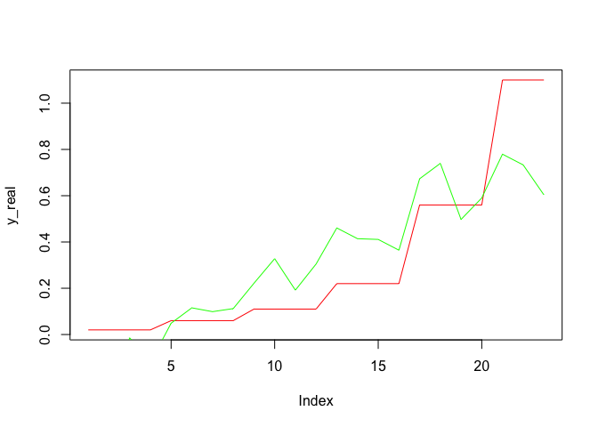

<!-- README.md is generated from README.Rmd. Please edit that file -->

# LinearRegressionR

<!-- badges: start -->

[](https://github.com/Lynn9358/LinearRegression-R/actions/workflows/R-CMD-check.yaml)
[](https://app.codecov.io/gh/Lynn9358/LinearRegression-R?branch=main)
<!-- badges: end --> <!-- badges: end -->

## Overview

Linear regression model in R is a package for simple and multiple linear
model fitting, providing a set of verbs that help to solve common model
fitting challenges.

- `LRM_R()` fits linear regression model using least squares method,
  displays the overall result of fitted regression model, calculates the
  estimated value，standard deviation and statistics value and
  confidence intervals of coefficients.

## Installation

You can install the development version of LinearRegressionR from
[GitHub](https://github.com/) with:

``` r
# install.packages("devtools")
devtools::install_github("Lynn9358/LinearRegression-R")
```

## Usage

``` r
library ("LinearRegressionR")
```

## Example

This is a basic example of Linear Regression:

``` r
library(LinearRegressionR)
## basic example code
LRM_R(mtcars$mpg~mtcars$disp +mtcars$wt+mtcars$qsec )
#> $coefficients
#>                  Estimate Std. Error     t value     Pr(>|t|)
#> (Intercept) 19.7775575655 5.93828659  3.33051585 0.0024420674
#> mtcars$disp -0.0001278962 0.01056025 -0.01211109 0.9904228666
#> mtcars$wt   -5.0344097167 1.22411993 -4.11267686 0.0003104157
#> mtcars$qsec  0.9266492353 0.34209668  2.70873496 0.0113897664
#> 
#> $r.squared
#>          [,1]
#> [1,] 0.826417
#> 
#> $fstatistic
#>          [,1]
#> [1,] 44.43538
#> 
#> $Y_model
#>         [,1]
#> 1  21.819587
#> 2  21.054736
#> 3  25.328857
#> 4  21.572994
#> 5  18.184716
#> 6  21.066571
#> 7  16.436796
#> 8  22.232013
#> 9  25.121427
#> 10 19.395434
#> 11 19.951423
#> 12 15.375933
#> 13 17.272962
#> 14 17.391901
#> 15  9.947693
#> 16  8.924976
#> 17  8.954593
#> 18 26.733651
#> 19 28.798848
#> 20 28.970642
#> 21 25.894628
#> 22 17.648337
#> 23 18.476512
#> 24 14.680325
#> 25 16.168463
#> 26 27.539542
#> 27 24.463577
#> 28 27.808705
#> 29 17.210001
#> 30 20.176761
#> 31 15.295297
#> 32 23.002099
```

To fit with actual value

``` r
#Dataset from an experiment on measuring the reaction velocity versus substrate concentration in an enzymatic reaction involving untreated cells or cells treated with Puromycin.
df_Puromycin = Puromycin[order(Puromycin$conc),]
y_real = df_Puromycin$conc
y_model = LRM_R(df_Puromycin$conc~df_Puromycin$rate +df_Puromycin$state)$Y_model
plot(y_real,type="l",col="red")
lines(y_model,col="green")
```



## Reference

Methods in this package mainly stems from [Introduction to Linear
Regression
Analysis](https://ebookcentral.proquest.com/lib/umichigan/detail.action?docID=7103892o)
